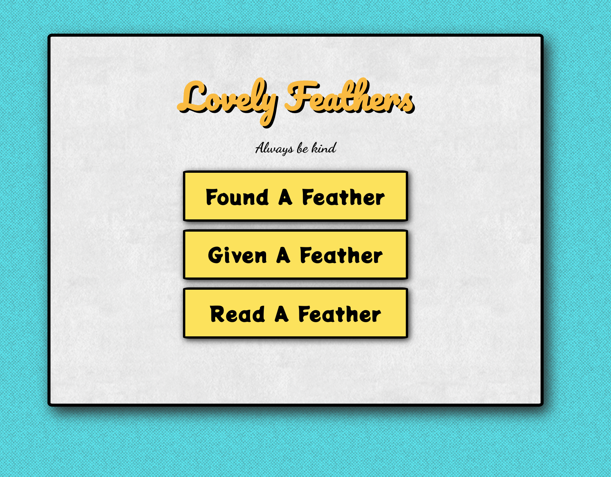

# Lovely Feathers
Lovely Feathers is a quick way for people to spread kindness through the act of passing a card containing a kind message.

## **Table of Contents**

- [Description](#description)
- [Project Screenshots](#project-screenshots)
- [How To Use / Set up](#how-to-use-/-set-up)
- [Reflection](#reflection)

## **Description**

Lovely Feathers is a web application built with React and Firebase. This project gives people the opportunity to spread positivity by sharing a card with a kind message. 

### **Technologies**

- React
- Firebase
- Google Analytics

## **Project Screenshots**

### Materials Covered

- Firebase security rules
- React Context API
- Caching
- Unit Testing
- Error Handling
- Community Involvement

## How To Use / Set Up

**Read A Feather**

- Go to the Lovely Feathers website
- Click "Read A Feather"
- Select a Feather's name or enter a Feather's ID

**Found/Given A Feather**

- Go to the Lovely Feathers website
- Click "Read A Feather"
- Select a Feather's name or enter a Feather's ID
- Click continue and read through the posts

## Reflection
### Story Behind The Project
### Challenges
### Unexpected Obstacles
### Reasons for Tools being use
- Challenges
- Unexpected obstacles
- What tools you used and why? (Justify your choices)
